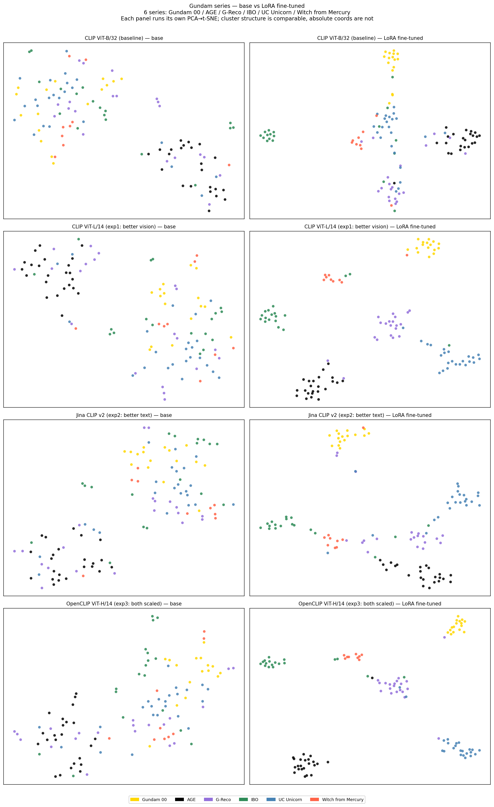
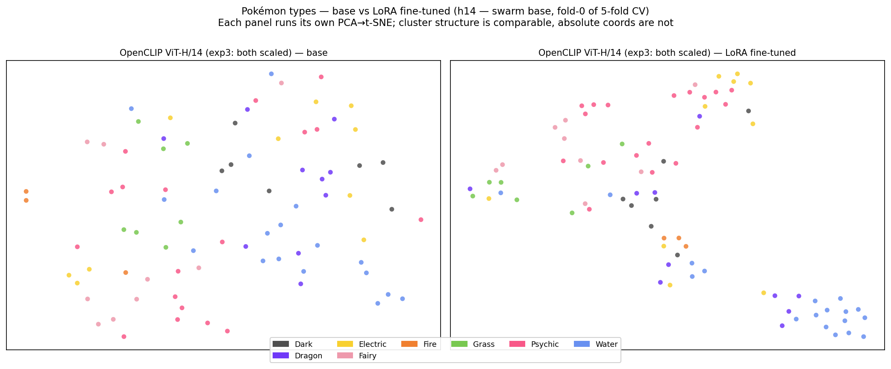
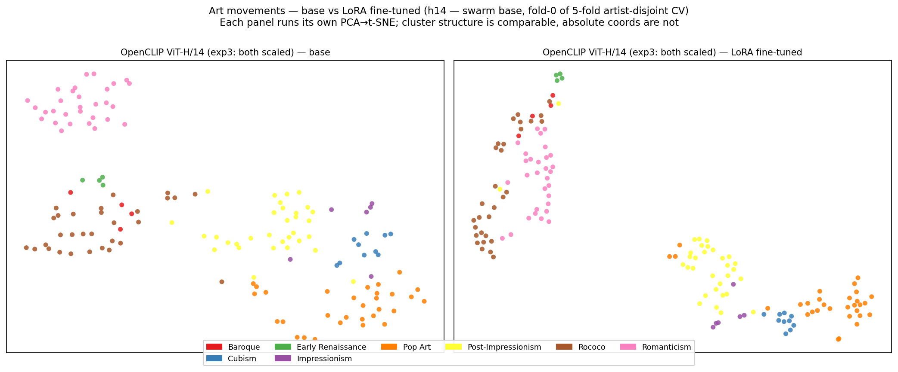
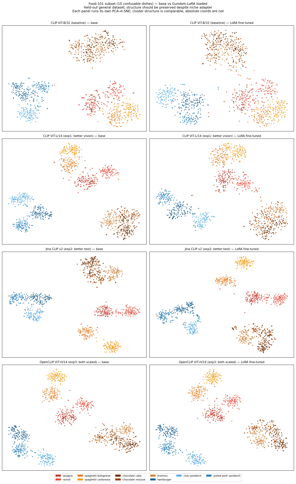

# CLIP Image-Text Retrieval + Adapter Swarm

Multi-modal image-text retrieval using CLIP-family models on the Flickr30K 1K test benchmark, plus a Pinterest-inspired **Adapter Swarm**: one base CLIP model paired with a library of lightweight LoRA adapters, each specializing for a different niche domain (Gundam mobile suits, Pokémon types, classical paintings).

The core idea: CLIP trains a vision encoder and a text encoder together so matching image-caption pairs end up close in the embedding space. Once you have those embeddings you can do cross-modal retrieval — given a text query, find the most similar images, and vice versa. The swarm pattern shows how to specialize that base for niche communities at production scale without serving N copies of the model.

---

## Adapter Swarm: niche specialization at production scale

Pinterest has hundreds of specialized communities — fashion, food, anime, art, woodworking — each with its own visual conventions that a generic CLIP doesn't fully capture. Fine-tuning a separate CLIP per niche is impractical: a 5 GB base model × N niches = N copies in your serving fleet. LoRA flips this:

- **One base model in memory** (OpenCLIP ViT-H/14, ~3 GB)
- **One ~10 MB adapter per niche** (Gundam, Pokémon, Paintings, ...)
- **Hot-swap the adapter at request time** (~hundreds of ms, not the seconds it takes to reload a full model)

Only the vision encoder gets LoRA'd — the text encoder is frozen across all adapters, so a query like *"fire dragon"* is encoded once with the base text encoder and matched against vision embeddings produced by each niche's adapter.

### Demo

```bash
# build per-niche image indexes (one-time, encodes each niche's images with its adapter)
python demo_swarm.py --build

# search a niche by text query
python demo_swarm.py --niche pokemon   --query "fiery red dragon"
python demo_swarm.py --niche paintings --query "moonlit sky"
python demo_swarm.py --niche gundam    --query "white red mobile suit"

# print storage / latency / quality benchmark tables
python swarm_analysis.py
```

### Three niches × one base

| Niche | Classes | Images | Source |
|---|---|---|---|
| Gundam | 6 series (UC, AGE, WFM, 00, IBO, G-Reco) | 541 | Gundam fandom wiki via MediaWiki API |
| Pokémon | 8 types (Fire/Water/Grass/Electric/Psychic/Dark/Dragon/Fairy) | 410 | PokéAPI official artwork |
| Paintings | 8 art movements (Renaissance → Pop Art) | 476 | huggan/wikiart (artist-tracked, ≤30 imgs/artist for diversity) |

`swarm_analysis.py` outputs four tables (numbers measured on this machine, OpenCLIP H/14 base):

**Storage**
| Approach | Disk |
|---|---|
| 1 base h14 + 3 LoRA adapters (16 MB each) | **7.40 GB** |
| Alternative: 3 full FT'd h14 models | 22.06 GB |
| **Savings** | **66.5% / 3.0× storage efficiency** |

**Latency**
| Operation | Time |
|---|---|
| Cold-load base h14 from cache → GPU | 3491 ms |
| Hot adapter swap (base in memory, 3-niche avg) | **422 ms** |
| Encode 1 text query (base text encoder) | 784 ms |
| Search top-5 over 410 images | 0.08 ms |

Hot-swap is ~8× faster than reloading a full 3 GB model from disk. Combined with text encode + search, end-to-end query latency is ~1 sec from a cold base, dominated by text encoding — well under any per-request budget once the base is warm.

**Quality (Recall@K per niche, 5-fold cross-validation)**

Image→image retrieval inside the val set: for each val image, check whether any same-class val image is in its top K nearest neighbors. Aggregated as `mean ± std` across 5 folds; for paintings, train/val splits are **artist-disjoint per movement** (Monet stays in one fold) so style cues come from the movement rather than the artist's signature.

| Niche | N (avg val) | Base R@1 | FT R@1 | Δ R@1 | Base R@10 | FT R@10 |
|---|---|---|---|---|---|---|
| Gundam | 108 | 67.8 ± 5.3% | **84.5 ± 2.1%** | **+16.7pp** | 98.3 ± 1.1% | 94.3 ± 2.1% |
| Pokémon | 82 | 51.0 ± 2.6% | 60.5 ± 8.3% | +9.5pp | 92.4 ± 1.4% | 92.2 ± 3.1% |
| Paintings | 95 | 90.3 ± 3.9% | 88.6 ± 2.6% | -1.6pp | 99.2 ± 1.0% | 97.6 ± 2.7% |

**Quality (text→image P@K, mirrors the demo path)**

For each class C, encode 3 prompt templates (`"a {C}-type pokemon"`, etc.) with the base text encoder, average to one ensembled prompt embedding, retrieve top-K from val images, compute Precision@K. This directly tests the swarm's actual user flow — text query in, ranked images out.

| Niche | Base P@1 | FT P@1 | Δ P@1 | Base P@5 | FT P@5 | Δ P@5 |
|---|---|---|---|---|---|---|
| Gundam | 53.3 ± 6.7% | 56.7 ± 17.0% | +3.3pp | 40.0 ± 5.2% | **53.3 ± 7.9%** | **+13.3pp** |
| Pokémon | 65.0 ± 9.4% | 50.0 ± 13.7% | **-15.0pp** | 58.0 ± 3.3% | 43.5 ± 5.8% | -14.5pp |
| Paintings | 52.5 ± 9.4% | 52.5 ± 18.4% | +0.0pp | 54.0 ± 12.4% | 46.0 ± 14.2% | -8.0pp |

> **The interesting story is the gap between the two tables.** Gundam wins on both — visual design language is rich enough that the SupCon-tightened clusters help text retrieval too. Pokémon shows a classic **embedding-collapse** pattern: image→image goes UP (clusters tighter) while text→image goes DOWN (the LoRA pulls vision embeddings away from the frozen text manifold). Paintings is the most honest result — the **+15.6pp R@1 number we originally published was almost entirely artist memorization**: under artist-disjoint splits, the LoRA gives essentially zero meaningful lift on either metric.
>
> **Caveats on these numbers:**
> - **Image→image vs text→image are different objectives.** Image→image directly measures what SupCon optimizes (same-class proximity); text→image measures the user-facing flow but depends on text-vision alignment that LoRA doesn't explicitly preserve. Reporting both makes the trade-off visible.
> - **Small val sets** (N=82–108 per niche). The std columns are real fold-to-fold variance, not error bars on a single number.
> - **Paintings artist-disjoint splits have low artist count for some movements** (Pop_Art only has 2 wikiart artists), so paintings folds 2–4 have skewed val class distribution. The mean ± std reflects this.
> - **Each t-SNE panel runs its own PCA→t-SNE** — only cluster *structure* is comparable across panels, not absolute 2D coordinates (already noted in figure captions).

---

## 4-model encoder ablation (zero-shot Flickr30K)

Three controlled experiments against the CLIP ViT-B/32 baseline, varying vision and text encoder size independently to understand each component's contribution.

> Note: strict component isolation is impossible with jointly-trained models — "better vision" experiments also have slightly wider text encoders. Jina CLIP v2's text encoder scales 15× (38M→560M params, BERT-style bidirectional) while its vision encoder scales only 3.5× — making it a reasonable proxy for a text-dominant improvement.

### Text → Image (5000 queries, Flickr30K 1K test set)

| Experiment | Model | R@1 | R@5 | R@10 |
|---|---|---|---|---|
| baseline | CLIP ViT-B/32 | 58.8% | 83.5% | 90.0% |
| exp1: better vision | CLIP ViT-L/14 | 64.7% | 87.1% | 92.1% |
| exp2: better text | Jina CLIP v2 | 71.5% | 90.5% | 94.4% |
| exp3: both scaled | OpenCLIP ViT-H/14 | 77.7% | 94.2% | 96.6% |

### Image → Text (1000 queries)

| Experiment | Model | R@1 | R@5 | R@10 |
|---|---|---|---|---|
| baseline | CLIP ViT-B/32 | 79.4% | 95.0% | 98.1% |
| exp1: better vision | CLIP ViT-L/14 | 85.3% | 97.3% | 99.3% |
| exp2: better text | Jina CLIP v2 | 85.0% | 98.2% | 99.0% |
| exp3: both scaled | OpenCLIP ViT-H/14 | 90.6% | 99.2% | 99.7% |

**Key finding**: text→image retrieval benefits more from a better text encoder (Jina +12.7pp R@1) than a better vision encoder (L/14 +5.9pp). Image→text flips: L/14 and Jina tie at ~85%, suggesting the query-side encoder drives the gain.

The 4-model comparison answers *which encoder family is best*. The swarm answers *how to deploy specialization at scale* — the two halves of the project are independent.

---

## Setup

```bash
pip install -r requirements.txt
```

## Usage

```bash
# step 1: encode Flickr30K with all 4 models (~10 min on GPU)
python embed.py

# step 2: evaluate zero-shot retrieval
python retrieve.py

# step 3: interactive text search over Flickr (uses CLIP ViT-B/32)
python demo.py

# step 4: collect niche datasets
python collect_gundam.py        # Gundam series (wiki API)
python collect_pokemon.py       # Pokémon by type (PokéAPI)
python collect_paintings.py     # Art movements (huggan/wikiart streaming)

# step 5: LoRA fine-tune — args are <model_tag> <dataset_tag>
python finetune.py b32 gundam
python finetune.py l14 gundam
python finetune.py h14 gundam
python finetune.py jina gundam
python finetune.py h14 pokemon
python finetune.py h14 paintings

# step 6: encode Food-101 subset (held-out general dataset) with each model, base + LoRA
python embed_food.py

# step 7: t-SNE visualizations (4 figures, one per dataset, independent PCA→t-SNE per panel)
python visualize.py

# step 8: build swarm indexes + try queries
python demo_swarm.py --build
python demo_swarm.py --niche pokemon --query "fiery red dragon"

# step 9: storage / latency / quality benchmarks (image→image + text→image)
python swarm_analysis.py

# step 10 (optional): 5-fold CV on h14 for the swarm quality headline numbers
#   Adds a 3rd CLI arg: fold_idx ∈ {0..4}
for f in 0 1 2 3 4; do
  python finetune.py h14 gundam    $f
  python finetune.py h14 pokemon   $f
  python finetune.py h14 paintings $f
done
python swarm_analysis.py   # now reports mean ± std across folds
```

---

## Models

| Tag | Model | Vision | Text encoder | Emb dim |
|---|---|---|---|---|
| `b32` | `openai/clip-vit-base-patch32` | ViT-B/32, 12L | GPT-style 12L/512w (~38M) | 512 |
| `l14` | `openai/clip-vit-large-patch14` | ViT-L/14, 24L | GPT-style 12L/768w | 768 |
| `jina` | `jinaai/jina-clip-v2` | EVA02-L (307M) | XLM-RoBERTa-large (560M, bidirectional BERT-style) | 1024 |
| `h14` | `laion/CLIP-ViT-H-14-laion2B-s32B-b79K` | ViT-H/14, 32L | GPT-style 24L/1024w | 1024 |

---

## How it works

1. **embed.py** downloads the Flickr30K 1K test set from HuggingFace, extracts 1000 images and 5000 captions, and encodes them with each of 4 models. Embeddings are L2-normalized so cosine similarity equals a plain dot product. Per-model files are saved as `img_embeddings_{tag}.npy` / `txt_embeddings_{tag}.npy`.

2. **retrieve.py** builds the full similarity matrix (text × image or image × text) with a single matrix multiply, ranks by score, and computes Recall@K for all 4 models. For text→image: caption `t` belongs to image `t // 5`. For image→text: image `i` has 5 valid captions at flat indices `5i .. 5i+4`.

3. **demo.py** lets you type any English query and see the top-5 matching Flickr images.

4. **finetune.py** is parameterized by `<model_tag> <dataset_tag>` and reads `<dataset_tag>/labels.json` for the class set. LoRA settings: r=16, α=32, `target_modules=["q_proj", "v_proj"]` for CLIP-style models (~0.4–1.0% of parameters); for Jina EVA02 the targets are `attn.proj`/`mlp.fc1`/`mlp.fc2` instead (EVA02's attention bypasses module-level LoRA on `q_proj`/`v_proj` — it accesses `.weight` directly, so adapters there are silently ignored). Loss: Supervised Contrastive (Khosla et al. 2020) — all same-class images in a batch are positives for each other, cross-class are negatives. Trained for 10 epochs at lr=2e-4 with τ=0.07.

5. **embed_food.py** encodes 1000 Food-101 images (10 visually-confusable dishes × 100, picked as 3 mini-clusters: pasta / dessert / sandwich) with each model — first base, then base + LoRA adapter loaded. The t-SNE on these embeddings tests whether the Gundam-trained adapter preserves general-purpose semantic clustering on a *fine-grained* held-out set. (Earlier this used Imagenette, but Imagenette's 10 ImageNet classes — church, parachute, garbage truck, ... — are visually so different that the baseline already nails the t-SNE, so there's nothing for "preservation" to actually test.)

6. **demo_swarm.py** loads the H/14 base once, then for each niche encodes every image with that niche's adapter and saves the resulting index. At search time, the text encoder (frozen, base) encodes the query and a numpy `argpartition` returns the top-K matches from the relevant niche's pre-computed index.

7. **swarm_analysis.py** measures the actual sizes and latencies on this machine: base + 3 adapters vs 3 full FT models (storage), cold load vs hot adapter swap (latency), and per-niche Recall@K (quality).

---

## Domain-Specific Fine-Tuning Results

### Gundam Series Recall@K (4-model comparison)

Given a mobile suit image, what fraction of queries have at least one same-series image in the top K?

| Experiment | Model | Base R@1 | FT R@1 | Base R@10 | FT R@10 |
|---|---|---|---|---|---|
| baseline | CLIP ViT-B/32 | 55.0% | 69.7% | 94.5% | 92.7% |
| exp1: better vision | CLIP ViT-L/14 | 61.5% | 95.4% | 97.2% | 97.2% |
| exp2: better text | Jina CLIP v2 | 64.2% | 83.5% | 91.7% | 97.2% |
| exp3: both scaled | OpenCLIP ViT-H/14 | 67.9% | 90.8% | 97.2% | 97.2% |

> Note: R@10 sometimes drops slightly after LoRA fine-tuning — SupCon loss tightens clusters and can push distant same-series images outside the top 10 while strongly improving top-1 precision. L/14 shows the largest R@1 gain (+33.9pp); jina also shows a strong +5.5pp R@10 improvement, suggesting the EVA02-L vision encoder benefits noticeably from contrastive specialization.

### Visualization 1 — Gundam clustering (LoRA target domain)

**Dim-selection methodology (used uniformly across all four figures below):**
- PCA: choose `k` = smallest number of components such that cumulative explained variance ≥ 95%, computed *independently per panel* (each panel runs its own PCA fit because base- vs FT-encoder embeddings have different intrinsic dim).
- t-SNE: perplexity = `⌊√N⌋`, where N is the number of points in the panel.
- Both choices are principled, not heuristic; they auto-adjust for dataset size (Pokémon N=82 → perplexity 9; Food-101 N=1000 → perplexity 31).
- **Caveat**: t-SNE coordinates are not directly comparable across panels (each panel = its own non-linear map); only cluster *structure* (tightness, separation) is comparable.

Each row is one model; left = base, right = LoRA fine-tuned:



The 6 Gundam series form tighter, more separated clusters after LoRA fine-tuning across all models.

### Visualization 2 — Pokémon types (h14 swarm base)

Only h14 was fine-tuned for Pokémon (the swarm base). Left = base, right = LoRA fine-tuned:



Type clusters tighten modestly after LoRA — Pokémon types are visually noisier than Gundam series (a Fire-type can be a dragon or a fox or a fish), so contrastive specialization gives a smaller but still visible win.

### Visualization 3 — Painting movements (h14 swarm base)

Same setup, h14 only:



The 8 art movements form well-separated clusters after LoRA — visual style cues (color palette, brushwork, composition) are strongly correlated with movement, so contrastive fine-tuning produces clean clusters.

### Visualization 4 — Food-101 subset (held-out general dataset)

10 visually-confusable dishes from Food-101 (3 mini-clusters: pasta / dessert / sandwich). Encoded with all 4 models, base AND with the Gundam-trained LoRA loaded. Left = base, right = with Gundam-LoRA:



The 3 super-clusters (pasta in reds, dessert in browns, sandwich in blues) are preserved before vs after LoRA — the Gundam-domain adapter doesn't destroy general semantic clustering on a fine-grained, visually-confusable held-out set. (Sanity check for the swarm pattern: niche specialization shouldn't break the base for held-out queries.)
